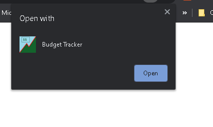
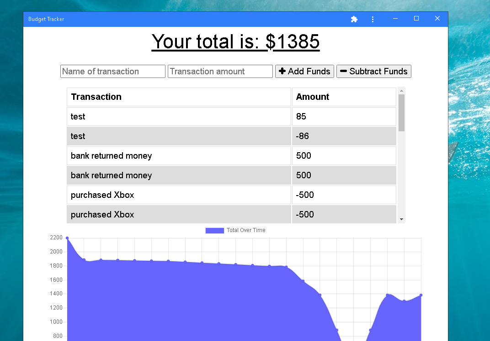
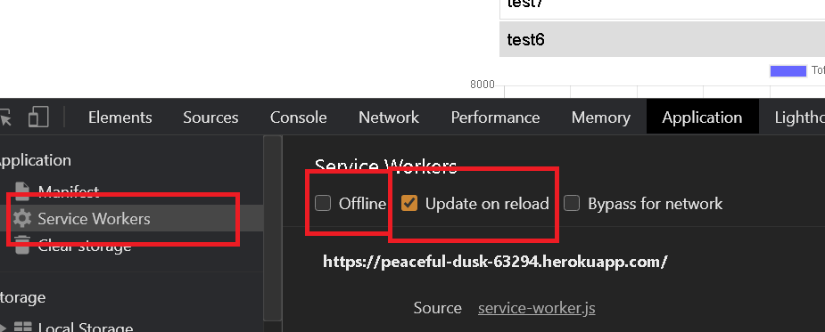

# PWA-Online-Offline-Budget-Trackers
PWA - Online/Offline Budget Trackers Example

## Description
This is an offline online PWA or progressive web application that is all the buzz these days. It can cache data locally and should you lose connectivity it will allow you to continue using it. You can and subtract from the balance as if you were online. Once connectivity is regained 
cached data will update the database which makes it a useful application for keeping tabs on your bank account balance. The app can be sampled and tested <a href= "https://peaceful-dusk-63294.herokuapp.com/"> here.</a>

## Installation
The application requries Node.js, Express Server, MongoDb and Mongoose.js. You can install this as stand alone application once the web page is loaded  </a>

## Testing the app
Note: Chrom Dev tools will be required to test.
You can test the PWA capabilities by first loading the page in Chrome. Once loaded right click and select Inspect. Select the Application tab, you 
can select manifest in Application>Service Wrokers in the left pane in Chrome Dev tools. Under service workers you can then selct the offline checkbox. Once you have selected you may refresh and notice that the page presists even under simulated offline conditions. Note you may have to enter a few transactions to force the page to cahce. Under offline conditions try to make some transactions and then go online again. Notice that 
your balance has accounted for your offline transactions!

